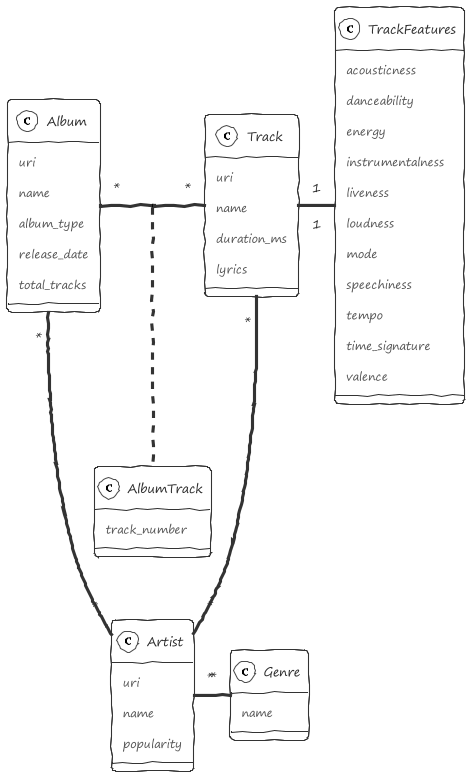

# Information Retrieval and Processing



## Instructions

- Install Python modules by running the following command:

```sh
pip install -r requirements.txt
```

- Create a `.env` file in the `src` folder, containing the Spotify application credentials:

```
SPOTIPY_CLIENT_ID=<client_id>
SPOTIPY_CLIENT_SECRET=<client_secret>
```

- Run the Python file:

```sh
cd src
python index.py 
```